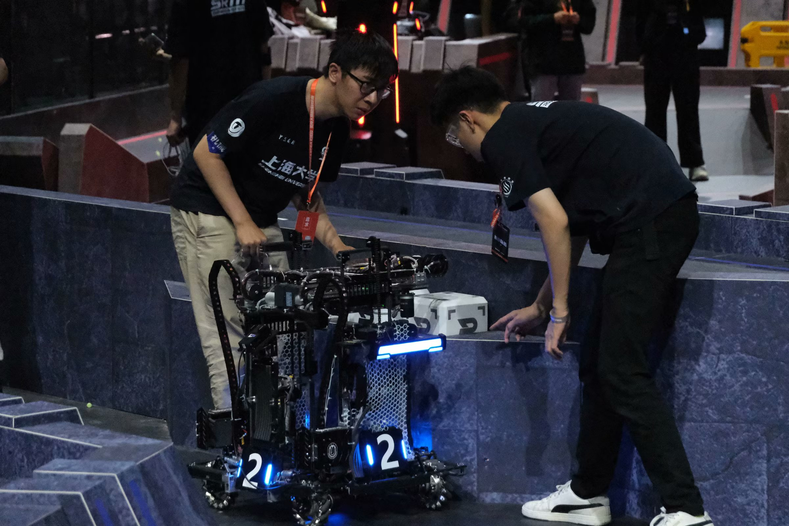
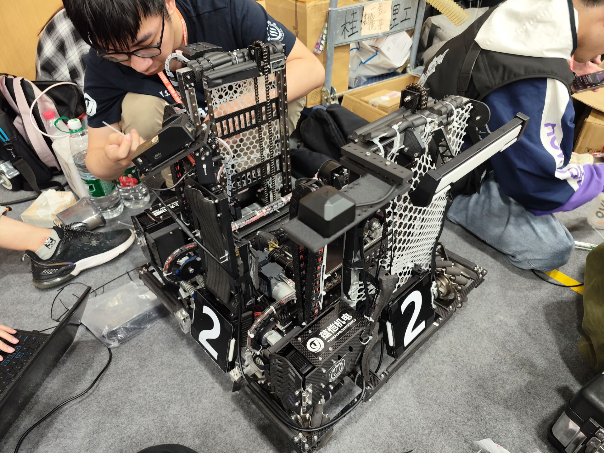
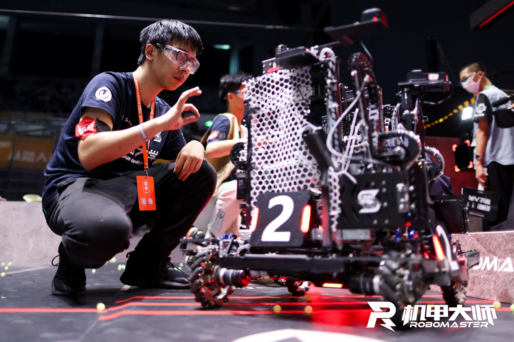

Manager: Yunzhe Li, Xinyu He, Chen Chen

Mechanical Structure: Chen Chen, Qiming Pu

Control: Jingyi Li, Kaicheng Li, Daoming He, Hanqing Huang

Functions:Catch minerals
* In the air
* On the ground
* In the slot

Access to full videos: [SRM Engineer Robot Reveal](https://youtu.be/qeRvdmcNFAc?si=Lao9lXq2gJHtXv1C)

