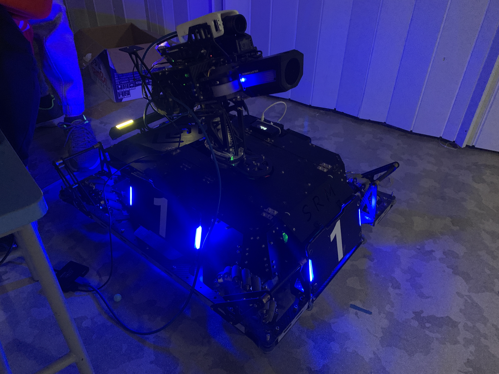
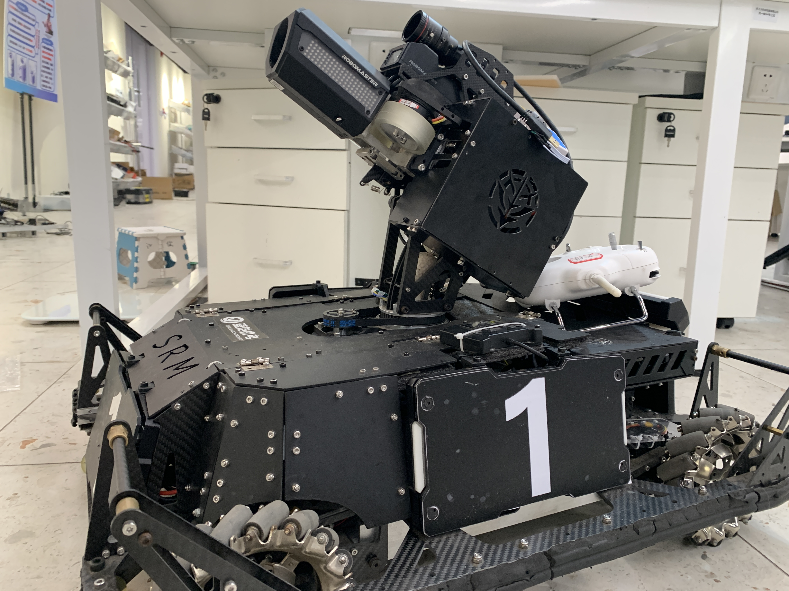
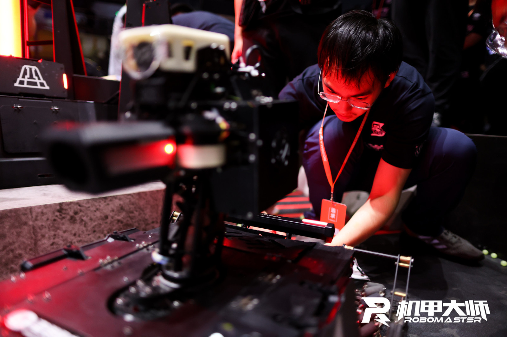

Manager: Yunzhe Li, Jialin Li

Mechanical Structure: Ziyi Tian, Mian Wu, Jialin Li

Control: Han Lu, Desen Luo, Kaiwen Zhou, Jingyu Chen

Vision: Yi Xie, Zhengyu Li, Yunzhe Li, Minjun Lu

Functions: Shoot 42mm pellets, dealing high damage
* Destroy Outpost
* Destroy Base
* Kill enemies

