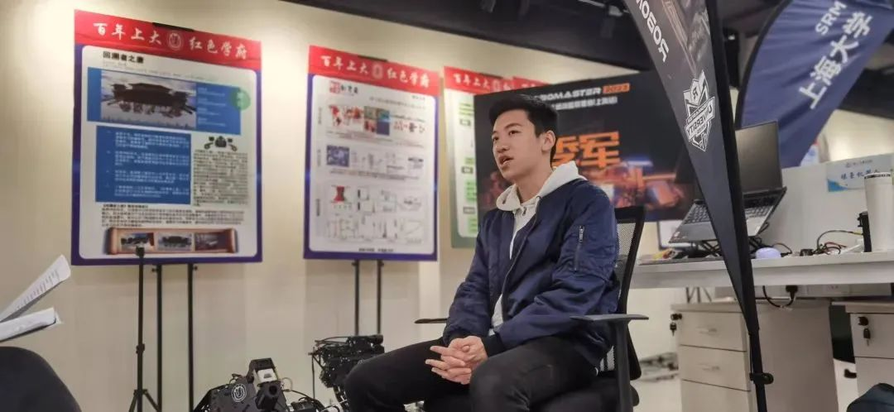

Access to Original Chinese Website: [Persistence + Effort! Look at this youth team on the road to pursue their dreams](http://www.shwmsj.gov.cn/bsq/2023/05/29/ea687ab5-0bbb-48f9-9eea-df2455f5f6de.shtml)

Recently, the Team SRM of Shanghai University ranked among the top eight in the 1V1 infantry match of the RoboMaster 2023 University League (Shanghai Station), and won the third place in the 3V3 match. It's hard to get to the top of a strong field.

In October 2017, the Team SRM of Shanghai University was founded based on the School of Mechatronic Engineering and Automation, under the guidance of Chen Yong, Yang Yang and other teachers, and with the help of the School of Innovation and Entrepreneurship of Shanghai University and the Circum-SHU Science Park, the construction of the SRM Robot Innovation Lab of Shanghai University was jointly completed. Today, the team has more than 40 undergraduate and several graduate project members, set up mechanical, electrical control, vision and operations four groups, across the school of computer science, communication and computer school and other teaching units.

Behind the achievements, the team members work hard day and night.

Because of his interest and love for robotics, Yang Chengjun, a 2021 undergraduate, joined the SRM team. "When I first joined the team, I first followed my senior teammates and sisters to learn relevant knowledge and do some basic work." In the process, he also had difficulties in learning and the imbalance of the game, and encountered the problem of the robot stopping to run, but when he saw his results running successfully on the game field, everything was so worthwhile. "No matter how difficult it is, you can see a group of like-minded people working towards an ideal, and the joy of self-improvement is beyond words." This is how Yang describes the biggest benefit of joining the team.

As the leader of the SRM team, Li Yunzhe, a 2020 undergraduate, feels the great responsibility he shoulders. The school provided the convenience of publicity and venues for the development of the team, and the encouragement and logistical support of the instructor to the team, which made Li Yunzhe deeply remember. In order to solve the problem of replacing new and old members of the team, Li Yunzhe and team members actively maintain communication with other university teams. Both cooperation and competition is the secret of promoting the progress of the SRM team at Shanghai University.

Since the establishment of SRM team in Shanghai University, it is inseparable from the hard work of instructors. But Chen Yong teacher only briefly mentioned his work, he said: "The idea of setting up the SRM team is in me, but the specific work is run thanks to the love of various departments in the school." The school has been very supportive of the policy, and the teaching units have also provided a lot of help in the specific operation of the team." It is reported that in 2020, SRM robot team led by Mr. Chen Yong has become the second batch of innovation studios built by the school. At present, the innovation studio has become a practice platform for cultivating students' innovation ability, practical ability and team spirit, and plays a role in the training process of innovative talents.

Chen Yong believes that practice is an important way to cultivate artisans in big countries. With students' own innovation and thinking as the first priority, the teacher's duty is to help students realize their dreams. Shanghai University SRM Team provides a practical world for students with active thinking, so that students can "do after learning, learn by doing". Although there are many difficulties in the process of combining knowledge and practice, the sense of achievement generated by students' solving problems is a valuable wealth. Seeing excellent students shine, this is the most gratifying thing for teacher Chen Yong.

After the interview with the SRM team of Shanghai University, the team members immediately returned to the debugging work of the robot.

Teacher Chen Yong revealed that the schedule was tight, and the team had to compete in the RoboMaster National Competition. "Students leave the team studio at 3am and are back in class at 8am the next day."

I wish the SRM team of Shanghai University a great success in the competition!
