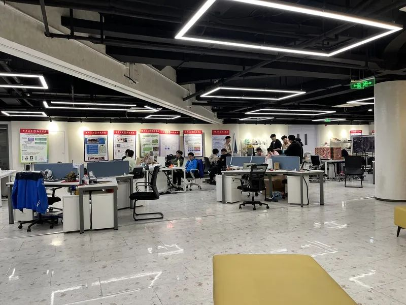
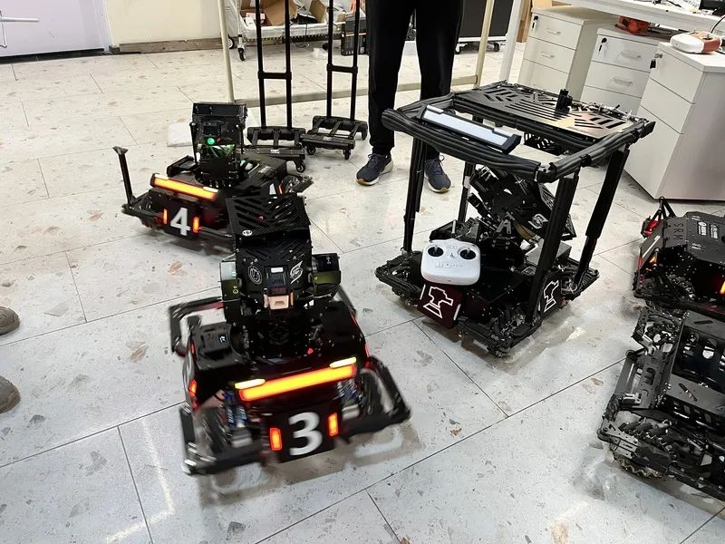
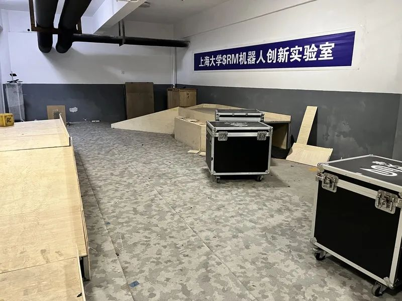

* Access to Jiefang Daily News: [Burn the midnight oil after class. This is where dreams set sail](https://www.jfdaily.com/staticsg/res/html/journal/detail.html?date=2023-05-14&id=352757&page=01)
* Access to WeChat Official Account: [Another wonderful night in Shanghai](https://mp.weixin.qq.com/s?__biz=MjM5ODI2NDMwMw==&mid=2653097965&idx=1&sn=186d610e82d7c63c0b424020f251e146&scene=21#wechat_redirect)

Night in Shanghai, exciting not only in the business district, cafes and bars. Recently, we visited several science and innovation parks located in the urban and suburban areas of Shanghai to observe the "lighting index" there, and communicated with the leaders of science and innovation enterprises, researchers, engineers, and college students entrepreneurs who stayed up all night to feel the ecology and vitality of science and innovation, and also enjoyed another wonderful night in Shanghai.

Sunset, the shadow of the trees dancing, traffic, people gradually dispersed, the road gradually quiet down. The Shanghai University on the north side of the road is more solemn and quiet at night. On the south side of the road, the ring building at the junction with Nanchen Road is still lit with lights.

Follow the light to find, then came to Baoshan ring big science and technology Park zero base. From the outside, this is an ordinary office building, but in the eyes of many young people, this is the place where they dream of setting sail. Since its launch in February 2021, this innovation and entrepreneurship base, which integrates the functions of entrepreneurship services for teachers and students, office space sharing, and scientific and technological achievements display, has registered a total of 214 enterprises and achieved 69 technological achievements transformation.

At night, who is still at the station, what are they busy? The reporter went into the building and approached the nightwalkers.

When it comes to the basement, people may think of it as dark, damp and cramped, but when you walk into the underground floor of the Zero base of the Grand Science and Technology Park in Huanshang, the space of 1,000 square meters is spacious and bright. In the middle is a dozen desks composed of 30 or 40 open work stations, on both sides of the distribution of several shared meeting rooms, sofa leisure area, self-service drinking area, toilet and other facilities are available.

Considering that many scientific and technological innovation teams and start-ups from the university have research and office needs, but it is difficult to find a suitable site, Baoshan University Science Park Company will renovate the underground floor, open every day from 8 to 22 hours, for free use by the team. "Some start-ups only have two or three people, so they can work here first, and college students can also make appointments in advance to study and discuss." Said Liu Zehua, director of technology transfer Department of Grand Science Park.

At 18, the reporter went to the underground floor for the first time, and did not see the scene of the heat in the imagination. Liu Zehua smiled. "Come back in two hours."

When he came again at twenty, the crowd was much larger. Liu Zehua explained that this is the characteristic of the innovation and entrepreneurship base around the university. The students were busy with their classes during the day and arrived after dinner.

A circle of people surrounded the station where several cool robots were placed, they were members of the SRM Mech team of Shanghai University, from the college of mechanical and electrical, computer, communication, materials and so on. A few days ago, they just participated in the 3V3 competition of the 22nd National college student Robot Competition RoboMas ter2023 Mecha Master University League (Shanghai Station). Team member He Zhengyu said, we are doing post-match replay. As the world's first shooting and confrontation robot competition, the competition integrates machine vision, embedded system design, mechanical design, human-computer interaction and other technical disciplines, attracting many domestic universities and science and innovation enthusiasts.

Zhengyu He is a junior student at Shanghai University. In his opinion, the days and nights spent struggling here with like-minded partners have become an indelible mark of youth. It was also in the process of preparing for the competition that he determined his future career ideal.

The SRM team was joined by members of the G-Master team from Xi 'an Jiaotong-Liverpool University. Seeing the students have such a research test site close to the campus, captain Lu's tone shows envy. What made him more impressed was that in order to meet the needs of robot ramp testing, the Science Park also built a simple laboratory for students in the garage.

