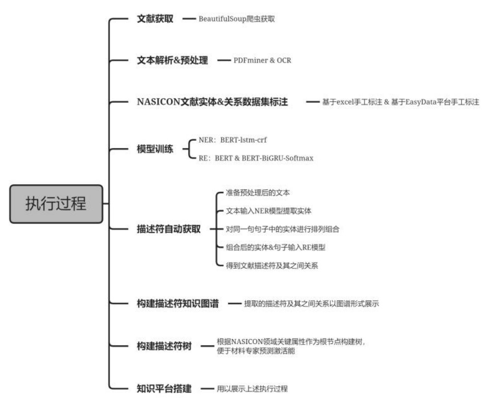

Project Leader: Yunzhe Li
Members: Licheng Zhen, Jiayao Zhang

<video src="./end.mp4" width="800px" height="600px" controls="controls"></video>

At present, data-driven machine learning has been widely used in the field of NASICON solid electrolyte materials to predict the activation energy and study the structure-activity relationship. Among them, the choice of descriptor is particularly important, it will affect the quality of data and thus affect the predictive performance of machine learning. However, there is a large amount of descriptor-related knowledge in the published scientific literature to be developed.

This project uses text mining method to extract descriptors from small batch NASICON solid electrolyte literature and build models based on them for training, so as to achieve automatic and efficient acquisition of NASICON solid electrolyte
A quality descriptor.

Document preprocessing is a necessary step in the construction of supervised material data sets, which can have a significant impact[11] on downstream text mining tasks. For knowledge acquisition, input data in PDF format cannot be processed directly. The methods of document preprocessing vary according to the text mining methods and the tools used at each stage. Among them, the initial preprocessing aims to obtain the material plain text data. PDF scientific research literature is one of the main carriers of text data storage, which is easy to obtain and more comprehensive. Therefore, large-scale text information extraction still needs to convert PDF into plain text format, that is, it needs to parse the crawled PDF document to extract text data from it. In the later stage of preprocessing, in order to obtain clean pre-labeled corpus such as words, phrases, statements or paragraphs, it is necessary to segment the text processed in the previous step with the help of symbolic tools and other technologies to process it into a single or whole sequence information.

**PDF2TXT processor based on PDFMiner:** Through this program to extract material plain text data from PDF documents. First, the PDF document is analyzed, and the PDF document is output to TXT format text data; Then, in this process, regular expression and other corresponding technologies are used to remove the content that is not conducive to literature mining, such as line breaking, references, graphs and tables. Finally, the remaining large amount of plain text content in PDF documents is stored in TXT text library.

**Text processing based on ChemDataExtractor and manual cleaning:** In the late preprocessing, the plain text data needs to be processed to get the data that can be used for annotation. In English text, punctuation is one of the more obvious ways to identify sentences, but material text is domain-specific, that is, language in materials science is often complicated by terms consisting of multiple words, symbols, and other types of structural entities. For example,(La0.8Sr0.2)0.97MnO3,(1−x)Pb(Zr0.52Ti0.48)O3−xBaTiO3, etc. Therefore, the field of materials requires specialized text processing tools, which are important for the success of text mining in materials science. ChemDataExtractor has the most complete function in the above three tools, and its operation is simple, user-friendly, and can handle the general field of material chemistry text. In addition, its version iteration is fast, indicating that the tool will integrate the latest technology in real time, and will have a greater competitive advantage in the future. Therefore, we use ChemDataExtractor as a material text symbol processing tool to realize text segmentation, clause and word segmentation of complex texts in the field of materials to obtain clean semi-structured text data that can be marked
