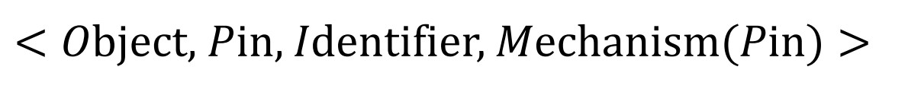

Project Leader: Yunzhe Li
Members: Licheng Zhen, Jiayao Zhang

Descriptors are an advantageous feature in predicting activation energy. A large number of descriptors for predicting activation energy exist in the literature related to NASICON solid electrolytes. At present, most domain experts can only rely on reading relevant literature, combining their own domain knowledge, manually extracting descriptors, and then making predictions. There are the following problems in such a process: First, NASICON solid electrolyte related literature is large in scale and comes from a wide range of sources, and manual extraction will consume great time and labor cost; Second, there are differences in individual knowledge. Considering that the selection of descriptors is very important, it is difficult to obtain the latest knowledge in time only by relying on manpower, resulting in lower accuracy of extracting descriptors. Third, in the era of massive data and big data, the falsification and tampering of data become easier and easier, and high-quality data is the premise of text mining. Meanwhile, the extracted descriptors cannot locate their sources and information associated with them, so the reliability of data is difficult to ensure, and the expansion research is difficult to carry out.

In view of the above three problems, this project innovates the current acquisition method and traceability mechanism of NASICON solid electrolyte descriptor, and proposes a method for automatic acquisition of NASICON solid electrolyte descriptor.

The main process of automatic descriptor acquisition is as follows: firstly, the literature of NASICON solid electrolyte is preprocessed and divided into input objects with sentence as unit; The sentences are input into the named entity recognition (NER) model which is trained and fine-tuned by the downstream task data. The identified entities are input into the RE model trained and fine-tuned by the downstream task data to obtain the relationship output between the corresponding entities. The entity and relationship are stored in the entity library and relationship library in the form of < entity name, entity type, sentence > and < entity 1, entity 2, relationship name, sentence > to realize the pipeline pipelinized automatic acquisition of NASICON solid electrolyte descriptors. To solve the problem that manual extraction is time-consuming and laborious, and it is difficult to select descriptors manually due to insufficient knowledge background.

The main formula for location descriptors to source and guarantee reliability is to define the Reliable Traceability Chain (RTC) model, which considers the entire task as a chain to represent each item under the task
The association between objects, each of which is called a link plate, can be described by the following quadruple:

Object is the specific content of the link board, which can be entity name, sentence name, document name, etc. Pin ={pin1, pin2,.. pinn} is the pin of each chain plate, which is used to associate and trace the information of other chain plates. It can be the Identifier of the source sentence and source document where the entity is located. Identifier is the unique identifier of the chain plate to distinguish different chains. It is also used as the associated identifier of the Pin, which can be the ID of the sentence and the DOI of the document. Mechanism(Pin) is an association or traceability Mechanism based on Pin. In the process of material text mining, Mechanism(Pin) in the traceability object of RTC model Link Plate is instantiated into two parts: basic traceability and process traceability. Basic traceability focuses on describing the basic meta-information of documents and sentences. Including but not limited to the title, author, abstract, keywords, text content, included journal, publication date, impact factor, DOI and storage path, etc. Process traceability mainly describes the processing information and change records of each step in the automatic acquisition process of pipeline pipelining, including but not limited to the input and output of the model, the results of the entity database and the relational database, and the time stamp of deletion and alteration

The RTC model enables real-time recording of all data acquisition, intermediate results, data sources, and processing processes during the experiment, effectively realizing traceability governance, and greatly enhancing the credibility of text mining for the processing of NASICON solid electrolyte descriptor. At the same time, the governance model has a good generalization, only need to replace the corresponding downstream task data and define the corresponding traceability mechanism, can be migrated to other material fields for effective application.
