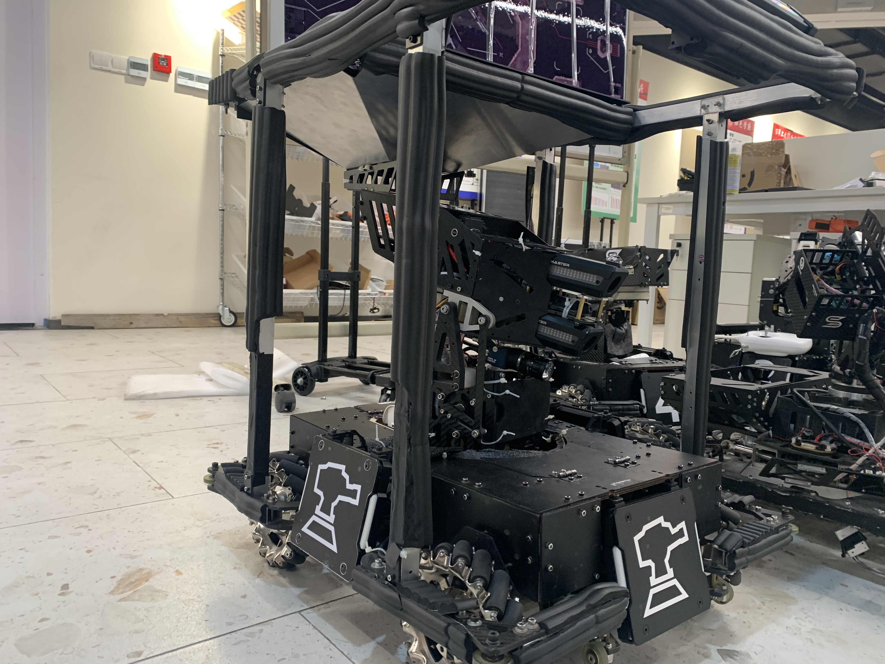
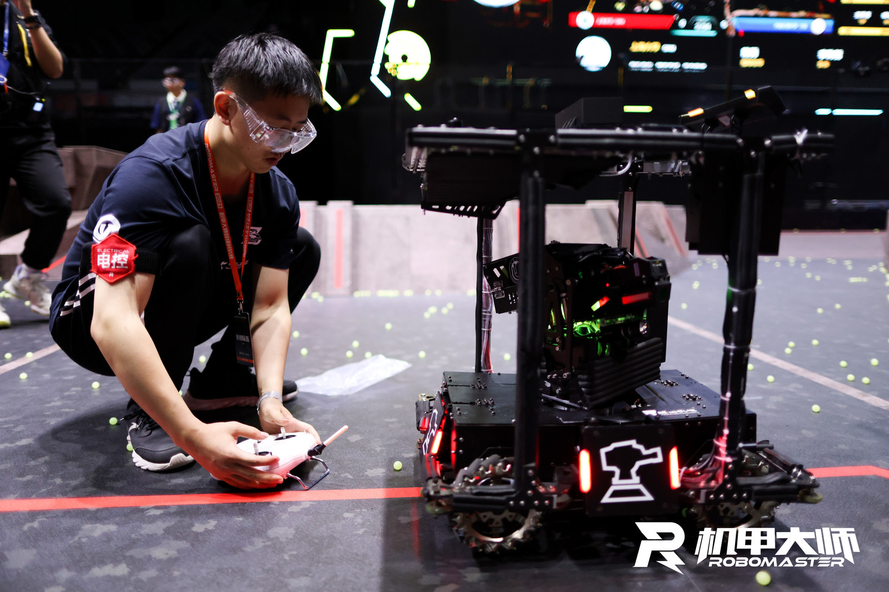
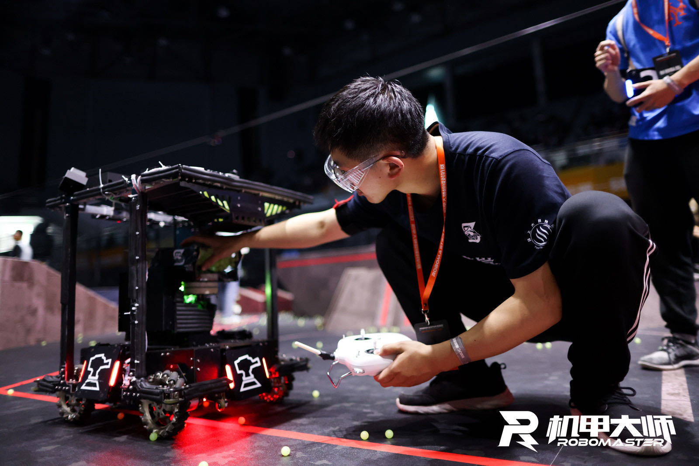

Manager: Yunzhe Li, Xinyu He, Jingsong Li

Mechanical Structure: Xiaoyu Yue, Zhengyu He, Mian Wu

Control: Jingsong Li, Chenjun Yang

Vision: Mingxuan Yang, Yi Xie

Functions: Shoot 17mm pellets
* Navigating by sensors/cameras
* Earning buffs
* Kill enemies

<video src="./1.mp4" width="800px" height="600px" controls="controls"></video>
