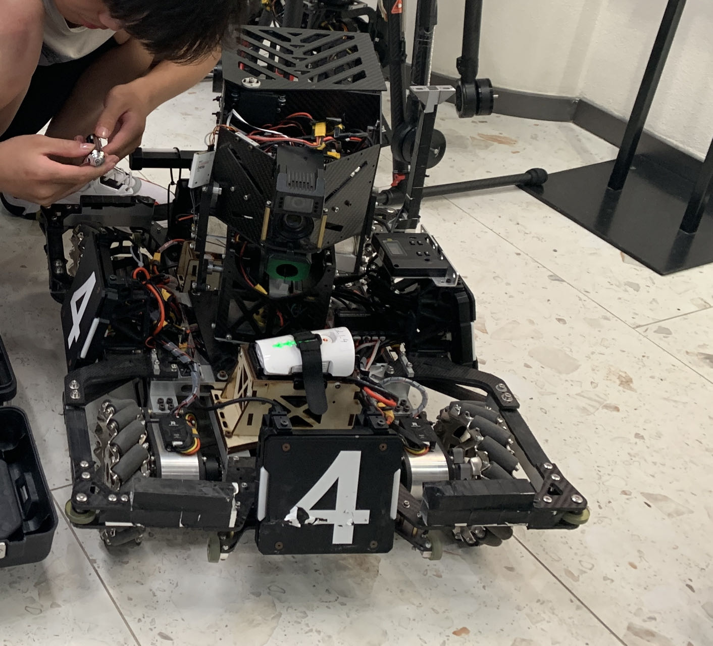
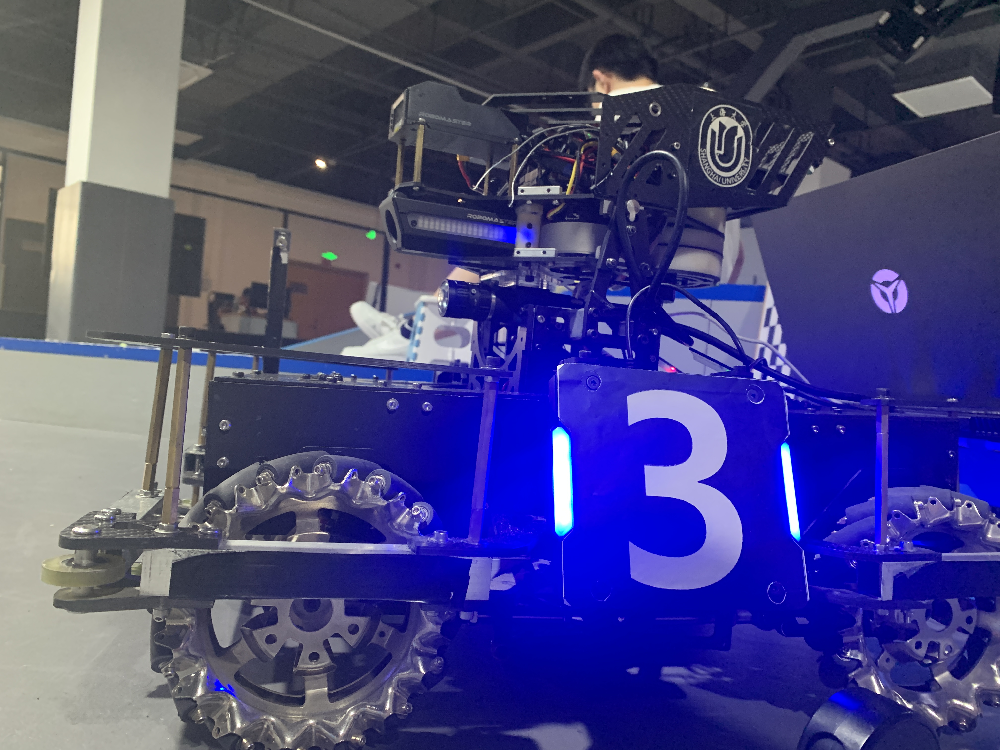
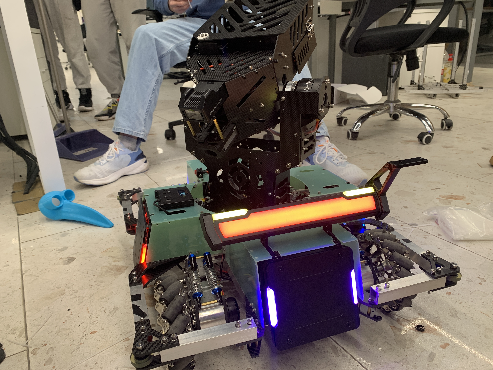
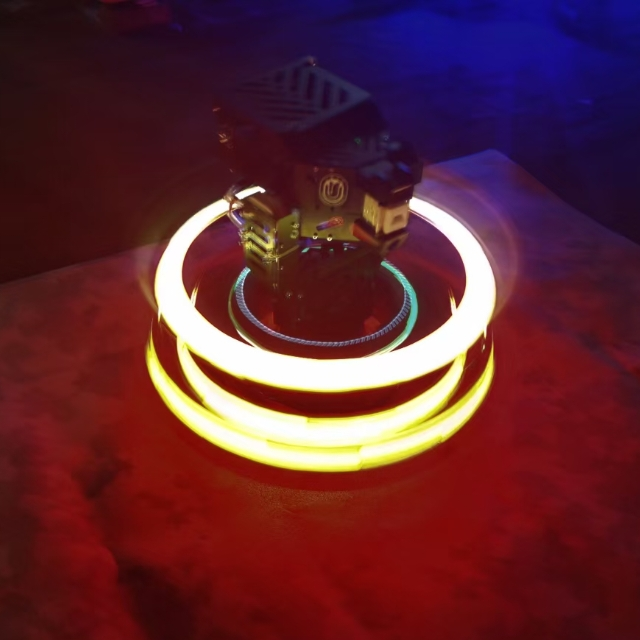

Mechanical Structure: Sijie Chen, Lingji Ming, Yunxin Luo
Control: Tian Guo, Zhuohan Fang, Yang Li, Chenjun Yang, Yuantao Tang
Vision: Yunzhe Li, Yi Xie, Xinyu He, Jun Chen, Mingxuan Yang

Functions:
* Activate Energy Rune
* Fly the Slope
* Spin and Shoot
* Omni-directional Motion;

<video src="./test-2.mp4" width="800px" height="600px" controls="controls"></video>
