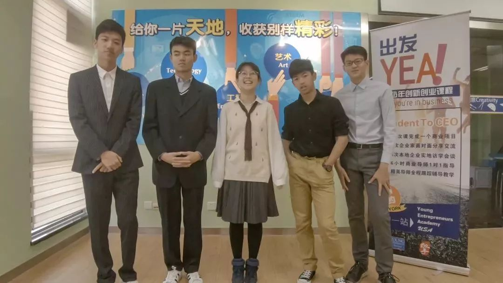
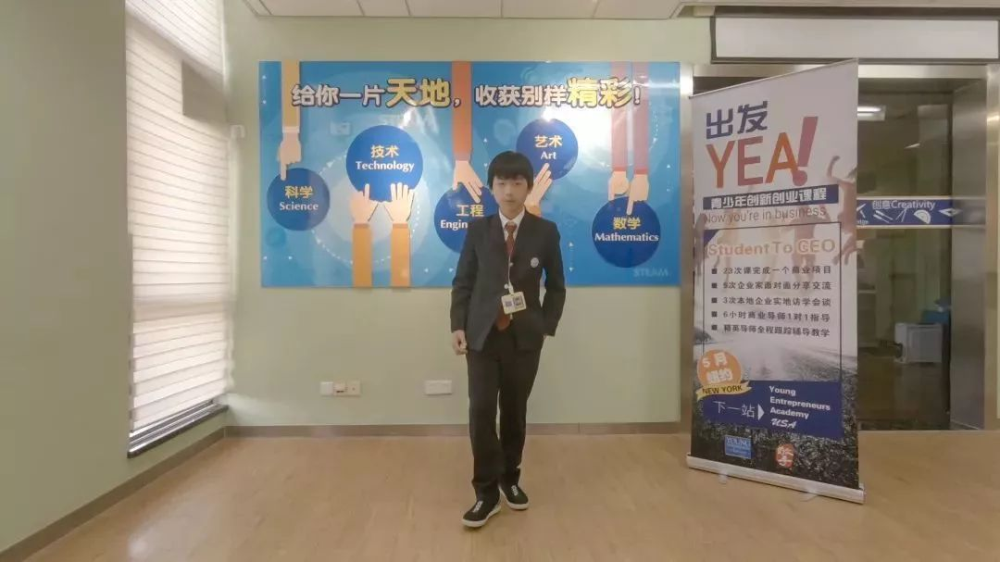
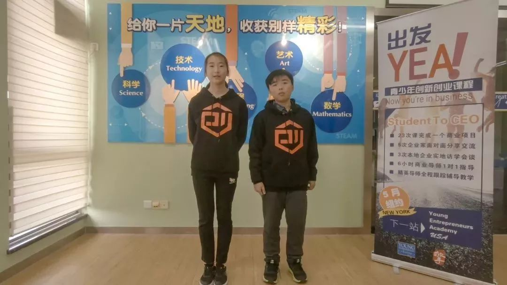
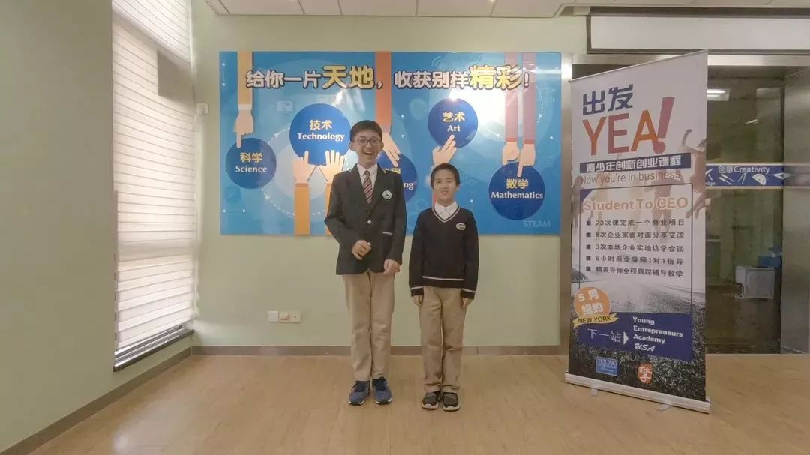
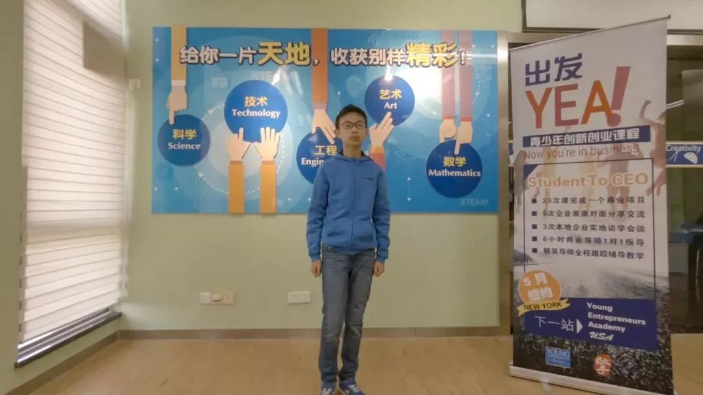
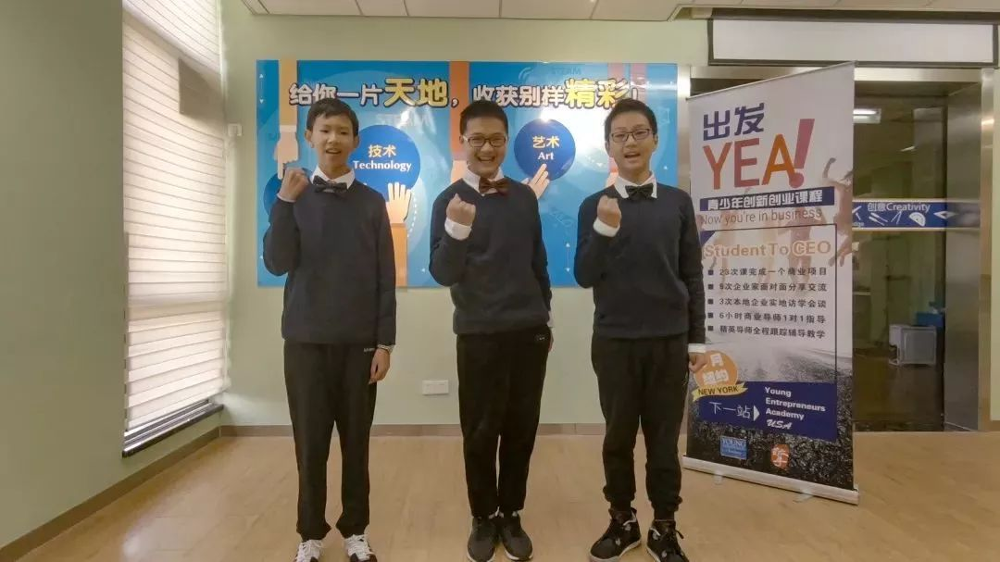

Access to Original Chinese Website: [YEA! Innovation and Entrepreneurship Competition Minhang roadshow ended, "young entrepreneurs" was born!](https://www.sohu.com/a/277210369_672245)

6 groups of youth entrepreneurship teams

14 teenagers with an average age of less than 13

After 134 days of hard work

Two field visits to enterprises

7 guest sharing and tutoring sessions

12 lectures by professional tutors

On the road show stage

This is their battlefield!

Recently, YEA! The roadshow of the second Innovation and Entrepreneurship Competition in Minhang was successfully held. This activity is sponsored by Minhang Education Bureau and hosted by the District Youth Activity Center. The activity lasted nearly 5 months, through the school recommendation, interview and other links, 14 students stood out and boarded the road show stage. Minhang District Science and Technology Association Vice Chairman Shi Huaqing, Minhang District Education Bureau deputy Director Qiao Huifang and other leaders attended the roadshow. Let's take a look at the contestants!

<video src="./yea/yea.mp4" width="800px" height="600px" controls="controls"></video>

<h2>Multi-function hammer</h2>

**Team Name**: HaMr

**Founder**:

* Shanghai Xinzhuang Senior High School 
  - Yunzhe Li
  - Zheng Yuan
  - Xinling He

* Shanghai Experimental School West School 
  - Wang Haoquan

* Shang Bao Secondary School
  - Chenqi Yan

**Product**: Multi-functional hammer

**Project introduction**:HaMr consists of 5 core members, they firmly believe that unity is strength, the ordinary hammer as the representative of the repair tool to redefine, inject "a multi-purpose" innovative technology, the combination of hammer and multi-function screwdriver, to provide consumers with greater convenience. Innovation changes the world! HaMr is committed to being a professional engineer around you!

<h2>Wastewater efficient self-purifier</h2>

**Team Name**: Xuanyuan Landscape

**Founder**: Tingxuan Jin, junior high School affiliated to the Second Affiliated High School of China Normal University

<h2>Innovative correction knife</h2>

**Team Name**: Chuang

**Founder**:

* Qibao No.2 Middle School
  - Duo Xu

* Shanghai Hanghua No.2 Middle School
  - Chenyi Tao

<h2>Smart temperature sensing toys</h2>

**Team Name**: FCL

**Founder**:

* Shanghai Experimental School West School
  - Zhenxu Jin

* Shanghai World Foreign Language Primary School
  - Zidong Shen

<h2>Farmland intelligent management system</h2>

**Team Name**: INAG

**Founder**: Zhiyuan Xu, Shanghai Xincheng School

<h2>Partner - See the world in VR</h2>

**Team Name**: TTW

**Founder**:

* Shanghai Xincheng School
  - Zewei Yu
  - Ziyu Wang

* Shanghai Hanghua No.2 Middle School
  - Zequan Wei
