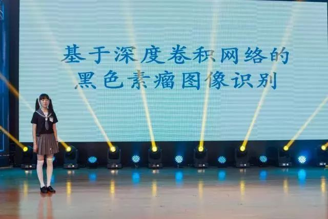

Access to Original Chinese Website: [Young students, big dreams, these 5 inventions of Minhang students are great!](https://www.sohu.com/a/234144674_503549)

<video src="./11.11/1.mp4" width="800px" height="600px" controls="controls"></video>

Innovation leads the future

2018 Minhang Youth Science and Technology Festival opening ceremony

And Minhang Young Edison Competition activities

It was successfully held in Xinzhuang Town Cultural Activity Center

Minhang young Edison style

<h2>01 Zhuofan Deng</h2>

Zhuofan Deng received the award for Best Contribution To Life

Shanghai Jiaotong University affiliated experimental primary School

Invention: adjustable forearm opening and closing device

Advisor: Le Pan and Xun Wu

The device is fixed on the door handle through a fixed component, and the forearm is placed on the component so that the forearm can rotate and push and pull the door handle, so as to realize the operation of opening and closing the door through the forearm of a person. This reduces the spread of bacteria caused by direct contact with the door handle in the process of opening and closing the door, reducing the chance of disease.

<h2>02 Chenyu Zhou</h2>

Zhou Chengyu won the annual champion of Minhang Young Edison

The Second Affiliated High School of East China Normal University Affiliated Junior High School

Invention project: Melanoma image recognition based on deep convolutional network cascade

Advisor: Bing Yang and Jianping Tang

Based on deep learning and big data, a novel medical image neural network is designed. The network diagnoses melanoma far better than human doctors, reducing the rate of misdiagnosis; It can also be used for other medical imaging to provide comprehensive diagnostic results on demand.

<h2>03 Club of Reserve the Creator</h2>

Club of Reserve the Creator received the Best Humanity Welfare Award

Yunzhe Li, Yuqi Yang, Wen Wang, 

Shanghai Xinzhuang Senior High School

Invention project: The future partner of the car - "Vehicle Omnidirectional chassis"

Advisor: Xu Zhuojiong

The scissor lift structure, paired with a pair of McNamum wheels, has no complex mechanical structure, and can park your car anywhere you want, no longer have to practice reversing technology.

<h2>04 Jiahao Cui</h2>

Jiahao Cui won the Best Market Value award

Shanghai Wenqi Middle School

Invention project: portable intelligent toner

Advisor: Xiaogang Xu

The portable intelligent color palette replaces a large box of pigments, palettes, pens and other materials with a portable handheld device, which solves the problem of environmental pollution caused by the cumbersome process of color mixing and the disposal of excess pigments. Color matching precision, wide range of color selection, high degree of intelligence, for the majority of art lovers and designers, advertising designers to use.

<h2>05 Mingyang Liu</h2>

Mingyang Liu won the Best scientific Potential Award

Shanghai Star River Bay Bilingual School

Invention project: Environment sensing system based on ultrasonic sensor filtering and fusion

Advisor: Chenjie Yu

This project uses Arduino single chip microcomputer as controller to design a safety alarm system based on ultrasonic sensor filtering and fusion. Including OLED display, vibration motor, three primary color full color LED, etc. It is installed on bicycles to warn cyclists and vehicles behind them to prevent accidents and personal injuries.
